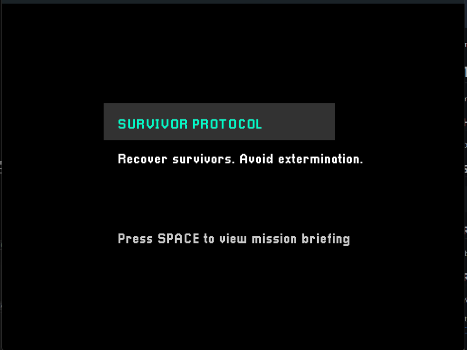
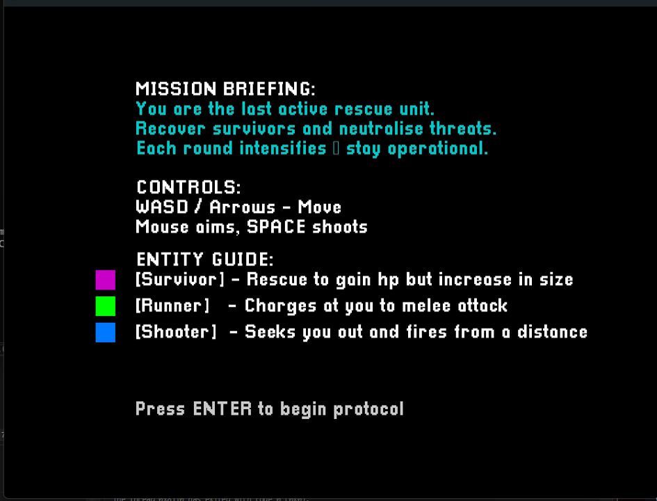
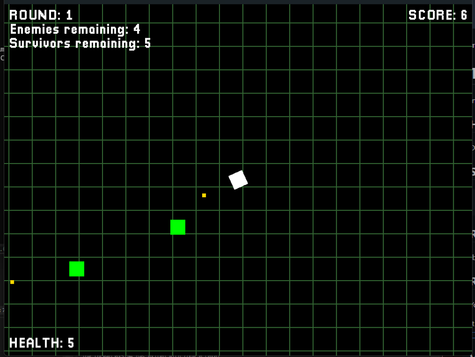
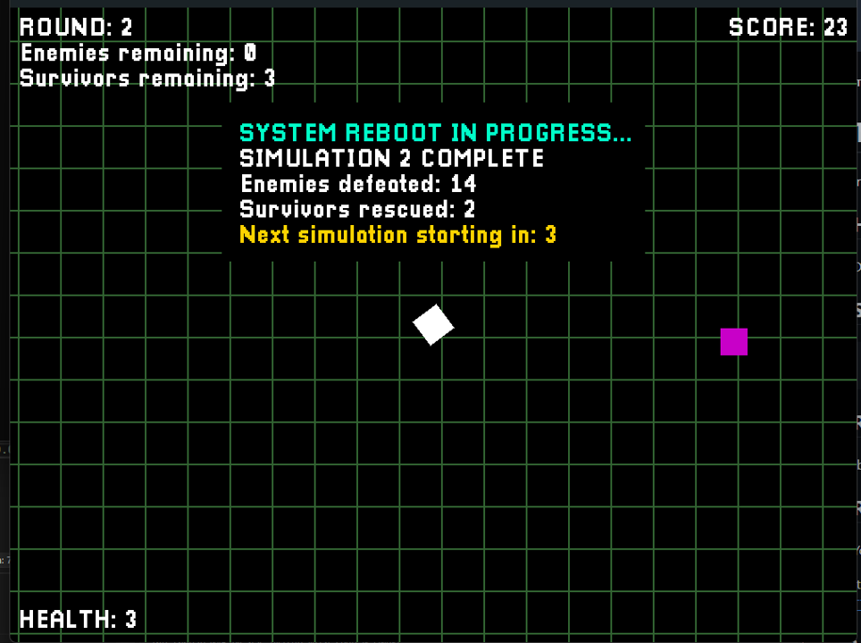
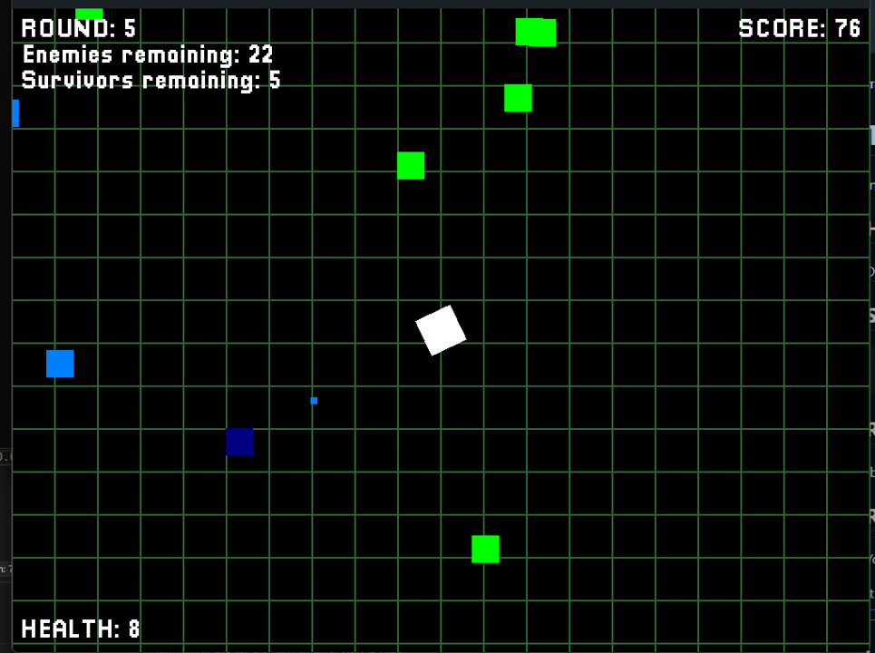
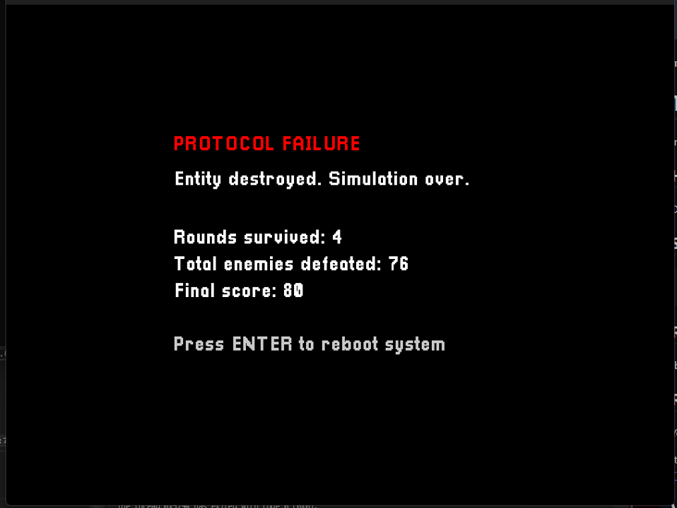
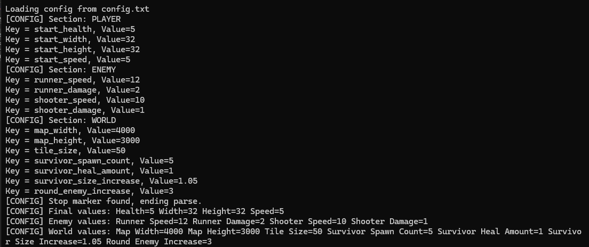

## COMP3016 CW1

# Survivor Protocol

Survivor Protocol is a 2D, top-down survival / bullet-hell simulation built in C++ with SDL3 enhancements for visuals.
You as the player control a rescue unit in a test survival environment. Each simulation round spawns hostile enemies and stranded survivors. Rescuing survivors will restore the players health, but also increases the size of the player entity, making it harder to dodge incoming attacks. The goal is to survive as long as possible in increasingly difficult simulation rounds.

This game demonstrates the following:
- Object-oriented codebase structure
- Runtime config loading from a .txt file
- Object Pooling
- Game state machine (SCORES <- START -> INSTRUCTIONS -> PLAY -> GAMEOVER)
- A simple narrative objective and theme

## Dependencies used  
This project was built in **C++** using **SDL3** for rendering, input and timing.

| Dependency      | Purpose                                         | Notes                                                                 |
|-----------------|--------------------------------------------------|-----------------------------------------------------------------------|
| **SDL3**        | Window creation, renderer, input, timing         | Core runtime dependency — included in the zip as `SDL3.dll`.          |
| **SDL_ttf**     | Text rendering for UI and in-game overlays       | Included in the zip as `SDL3_ttf.dll`.                                |
| **Pixellari.ttf** | Custom pixel-style font for text rendering      | Bundled with the project and loaded at runtime.                       |
| **C++ STL**     | `vector`, `string`, file I/O, `cmath`, `<chrono>` | Used for all data management and logic; no C-style arrays or `char*`. |

---

## How to Run the Game

1. **Extract the .zip file** (`OliverCole_COMP3016_CW1.zip`) to any folder on your computer.  
2. Inside the extracted folder, you’ll find:
   - `COMP3016_CW1.exe`  
   - `SDL3.dll`  
   - `SDL3_ttf.dll`  
   - `Pixellari.ttf`  
   - `config.txt` and `scores.txt`
   - `COMP3016_Cw1_Oliver_Cole.txt`
3. **Double-click `COMP3016_CW1.exe`** to launch the game.  
   - No setup in Visual Studio or installation steps are required.  
   - The game window will open and can be played immediately.  
4. To exit the game, simply close the window.  

> *(Optional)* You can edit `config.txt` or `scores.txt` in a text editor to view or modify configuration values or scores — these are read and written by the game at runtime.


## Use of AI description
This assignment is under the **“Partnered Work”** category, so AI use is allowed as long as it is declared.

AI was used **as an assistive tool** for:

- helping structure the game into classes (`Game`, `Player`, `EnemyPool`, `SurvivorPool`);
- helping to identify and resolve errors;
- suggesting improvements to code readability and comments;
- teaching code concepts and providing examples - final code written by myself
- drafting this README

Final submitted code has been written by myself, with help from Visual Studio 2022 IDE AI assistant autofill, all autofilled code was reviewed and controlled by myself.


## Game programming patterns used
### 1. Object Pooling
- Used for **enemies**, **survivors**, and **bullets**.
- On spawn, the code reuses an inactive object instead of allocating a new one.
- This keeps runtime stable and avoids having to constantly create and destroy items.

### 2. Simple Game State Machine
States are handled in `Game::update()` and `Game::render()`:

- `START`
- `SCORES`
- `INSTRUCTIONS`
- `PLAY`
- `GAMEOVER`

### 3. Data-Driven Configuration
- On startup the game calls `Game::loadConfig()` and reads from `config.txt`.
- Sections:
  - `[PLAYER]` -> start health, size, speed
  - `[ENEMY]` -> enemy speed/damage
  -  `[WORLD]` -> survivor spawn, hp gain, growth perceptage - Map size, background grid and enemy spawn increases

### 4. Encapsulation of Entities
- `Player`, `Enemy`, `Survivor` each own their rect, update, and render.
- The `Game` class orchestrates them (spawning, collisions, round progression).
- This demonstrates OOP.


## Game mechanics and how they were coded
### Player
- **Movement:** `Player::update()` reads keyboard (`SDL_GetKeyboardState`) and moves the rect.
- **Bounds:** player is clamped to the map size by moving them back into the map bounds when movement would place them out of bounds.
- **Aiming:** mouse position → `atan2` → `angleRad`.
- **Shooting:** SPACE spawns a bullet from the player’s bullet pool with a short cooldown.

### Enemies
- **Runner:** chases the player directly, deals contact damage.
- **Shooter:** moves towards player until in range, then stops and fires bullets using the enemy bullet pool.
- Enemy stats (speed, damage) now come from the **config** when spawned:
  - runner → `enemyRunnerSpeed`, `enemyRunnerDamage`
  - shooter → `enemyShooterSpeed`, `enemyShooterDamage`

### Survivors
- Spawned each round.
- Collision with player:
  - heals player;
  - increases player size slightly;
  - survivor is deactivated in the pool.
- This is the “risk/reward” part of the gameplay.

### Rounds / Simulation Loop
- At the start of PLAY: enemies + survivors are spawned.
- When all enemies are dead: `roundInProgress = false` → round summary overlay is shown.
- After a short timer: next round is started and more enemies are spawned and survivors refresh.

### Scoring
- +10 per kill
- +50 per survivor saved
- final score saved and compared to those in scores.txt, then top 5 scores kept


## Sample screenshots
Below are a few screenshots taken during gameplay.
### Start screen


### Instructions


### Play and round summary




### Game over


### Terminal config reading


## Exception handling


### File I/O Validation
Before reading or writing configuration and score data, files are checked for availability:
```cpp
std::ifstream configFile("config.txt");
if (!configFile.is_open()) {
    std::cerr << "Failed to open config.txt\n";
    return;
}
```
### Null-pointer pool safety
Object pools validate before use:
```cpp
Enemy* enemy = enemyPool.getEnemy();
if (enemy) {
    enemy->init(enemyX, enemyY, enemyRunnerSpeed, enemyRunnerDamage, type);
}
```
### State and input validation
Inputs ar ehandled within a gated switch statement:
```cpp
switch (state)
{
case GameState::START:
    // Press SPACE to go to instructions, H to go to scores
    if (keys[SDL_SCANCODE_SPACE])
        state = GameState::INSTRUCTIONS;
	else if (keys[SDL_SCANCODE_H])
		state = GameState::SCORES;
    return;
  ...
}
```

## Further details

- Rendering is deliberately simple (rects and colours) to make logic visible.
- Colours are consistent:
  - player → white
  - survivors → purple
  - runner → green
  - shooter → blue
- Grid is rendered behind gameplay for spatial reference.
- High scores are read from and written to `scores.txt` 
- Config file ends with a `-- Notes for reader --` stop marker so comments don’t break parsing.


## Evaluaion
I sucessfully produced a playable, 2D top down bullet hell written in C++ and SDL3.
I have demonstrated OOP principles, Object pooling principles and the use of classes and a state machine. I also wa sable to successfully read data from a config.txt file handling game variables.

### Achievements
- Functional and stable game loop using a state machine (START, INSTRUCTIONS, PLAY and GAMEOVER)
- OOP structure - Using encapsulated classes for `Game`, `Player`, `Enemy`, `Survivor` etc and respective object pools
- Object pooling for efficient bullet, enemy and survivor resuse rather than creation/destruction
- Reading from a config file, handling game variables for such as map size, enemy damage and player stats
- Reading and writing to a high scores file, showing file IO skills
- Escalating difficulty round system for challenging gameplay
- A light narrative theme providing context and interest to the game

Overall I managed to achieve a functional and replayable 2D bullet hell game in C++ that meets the specified requirements.

### What i would improve on
- Implement powerups and buffs to enhance gameplay and encourage replayability
- Write to a high score .txt file for comparison of high scores
- Add sound effects to enhance gameplay immersion
- Create assets for game objects like player, enemies and survivors
- Expand config input to handle more complex operations
- Improve score handling to save player names
- Add pause functionality and in game settings

Overall, the current version achieves its core design objectives, and future iterations would focus on gameplay depth rather than refactoring for code readability.

### Where i made msitakes
- Underestimating time for gameplay tuning and testing, features that looked to be simple often took a lot more fine tuning
- Poor planning - I had to refactor my codebase structure for some features, costing time with no immediate benefit from it - in future i would plan out the core structure before building code
- Setup issues - Difficulty in setting up and learning SDL3 to work effectively in the project

This project involved a steep learning curve and several technical challenges that helped build better understanding of good coding practices and the value of proper planning

